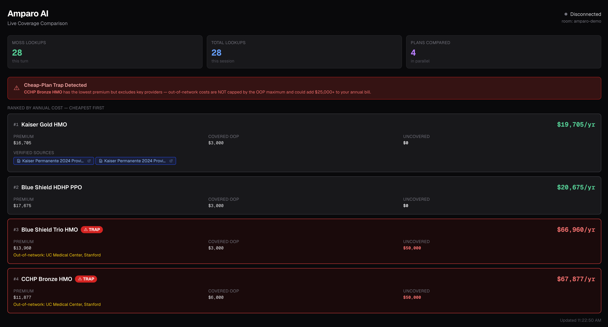

# Amparo AI

A multilingual **voice agent** that helps employees understand their health insurance. Call a real phone number, describe your situation, and get an instant personalized comparison of your actual plan options — costs computed deterministically, every fact cited to the source PDF, powered by parallel Moss retrieval.

**Live number: +1 (415) 417-6002**

Hackathon project — Moss @ YC.

---

## Demo

<!-- Drop your screenshot/GIF here -->


<!-- Drop your citation chip screenshot here -->


---

## The problem Amparo solves

Maria is pregnant, takes Humira for arthritis, and wants to deliver at UCSF. She has 4 plan options during open enrollment. She has 10 minutes to decide.

**CCHP Bronze** looks cheapest at **$990/month**. It's actually the worst choice for her — UCSF is out-of-network, adding a $25,000 delivery cost that is **NOT capped by the OOP maximum**. She'd pay it on top of everything else.

**Blue Shield HDHP PPO** at $1,473/month includes UCSF in-network and costs Maria **$22,000 less per year**.

No existing tool catches this in a voice conversation, in real time, with citations.

---

## Real plans (Covered California 2024)

| Plan | Monthly Premium | Maria's Annual Cost | Note |
|---|---|---|---|
| Blue Shield HDHP PPO | $1,473 | ~$20,675 | ✅ WINNER — UCSF in-network |
| CCHP Balance Bronze HMO | $990 | ~$42,877 | ⚠ TRAP — UCSF out-of-network |
| Kaiser Permanente Gold HMO | $1,392 | ~$44,705 | ⚠ TRAP — closed network |
| Blue Shield Trio HMO | $1,163 | ~$66,960 | ⚠ TRAP — narrow Trio network |

The trap is **network exclusion, not drug coverage** — all 4 plans cover Humira (~$250–500/fill). The $25,000 uncovered UCSF delivery cost bypasses the OOP max entirely.

---

## Architecture

```
Phone call (+1 415-417-6002)
  → LiveKit SIP → STT (Deepgram nova-3, multi-language)
  → extract_constraints (LLM → typed Constraints dataclass)
  → parallel Moss retrieval (28 asyncio.gather queries across 4 plans)
      ├── benefit facts  (premium, deductible, OOP max, HSA)
      ├── drug coverage  (Humira formulary tier, cost, coinsurance)
      └── provider network (UCSF, Stanford in/out-of-network)
  → deterministic cost math (plain Python — never LLM)
      formula: premium×12 + min(covered_oop, oop_max) + uncovered_costs
      invariant: OON provider costs are NOT capped by OOP max
  → cited plain-language reply (trap exposed, ranked cheapest-first)
  → TTS (MiniMax speech-02-turbo, 40+ languages, auto code-switching)
  → frontend panel (live plan_comparison data message over LiveKit)
      └── CitationChip → real Covered CA PDF at exact page + bbox
```

**Moss is the hero.** A standard vector DB takes ~350ms per query. 28 sequential queries = 10 seconds of dead air on a voice call. Moss in-process retrieval: 3–10ms per query. All 28 fire simultaneously via `asyncio.gather`. Total wait = slowest single query. The panel shows it in real time.

---

## Stack

| Layer | Tool |
|---|---|
| Voice infra | LiveKit Agents 1.5.x + SIP |
| Retrieval | **Moss** (in-process, hybrid search, α=0.6) |
| STT | Deepgram nova-3 (`language="multi"`) |
| TTS | MiniMax `speech-02-turbo` (40+ languages, auto code-switching) |
| LLM | OpenAI GPT-4o (via LiveKit Inference) |
| Plan parsing | Unsiloed (PDF → structured + bbox citations) |
| Frontend | Next.js 15 (subscriber-only LiveKit room observer) |
| Phone number | LiveKit SIP (+1 415-417-6002) |

---

## Key features

### 1. Parallel Moss retrieval — 28 queries in <100ms
Each user turn fires one query per (plan × fact dimension) concurrently. No precomputed tables — every answer is freshly retrieved from the indexed plan documents.

### 2. Deterministic cost math
`annual_total = premium×12 + min(covered_oop, oop_max) + uncovered_costs`

The LLM never touches numbers. It extracts constraints from speech; Moss retrieves facts; plain Python computes costs. A hallucinated cost is a project-ending bug.

### 3. OOP-max trap detection
Uncovered OON provider costs are explicitly excluded from the OOP cap. The engine flags any plan where this applies as `trap=True` and surfaces it in the reply and panel.

### 4. Curveball re-grounding
`Constraints.merge()` unions new info with prior context — drugs, providers, and events accumulate across turns. Nothing is dropped. Say "what about Stanford?" and both UCSF and Stanford are queried in the next turn.

### 5. Clinical guardrail
Deterministic regex classifier intercepts clinical questions before the LLM sees them. Fires the handoff line instantly: *"That's a question for your doctor or pharmacist."* No latency, no hallucination risk.

### 6. Bbox citations
Every benefit fact is linked to its exact location in the real Covered California PDF — page number + normalized bounding box. Judges click a chip and see the actual dollar amount in the real insurer document.

### 7. Multilingual
MiniMax `speech-02-turbo` auto-detects and responds in the user's language. No model switching. Speak Spanish, get Spanish back.

---

## Project structure

```
amparo-ai/
├── agent-py/
│   ├── src/
│   │   ├── agent.py              # Main LiveKit agent — session, tools, guardrail hook
│   │   ├── compare_plans_engine.py  # Parallel Moss retrieval + cost math wiring
│   │   ├── constraints.py        # Constraints dataclass + merge logic
│   │   ├── cost_math.py          # Deterministic cost formula + ranking
│   │   ├── guardrail.py          # Clinical question classifier (regex, no LLM)
│   │   └── minimax_tts.py        # Local MiniMax TTS adapter (SSE + endpoint fix)
│   ├── data/
│   │   ├── plans/                # 4 real CA ACA plan JSONs
│   │   ├── personas/             # Maria persona
│   │   ├── pdfs/                 # Real Covered California PDFs
│   │   └── citations/            # Unsiloed bbox output per plan
│   └── tests/                    # 85 tests (golden costs, guardrail, merge, tools)
├── frontend/
│   ├── app/
│   │   ├── api/token/            # Subscriber-only LiveKit JWT
│   │   └── api/room-status/      # Polls room existence before connecting
│   ├── hooks/usePlanComparison.ts  # LiveKit data message listener
│   └── components/PlanComparisonPanel.tsx  # Live comparison table + citation chips
└── scripts/
    ├── create_index.py           # Seeds Moss with 37 plan fact docs + bbox metadata
    ├── parse_with_unsiloed.py    # Submits PDFs to Unsiloed, extracts bbox citations
    ├── watch_and_dispatch.sh     # Polls for room + auto-dispatches agent (SIP fallback)
    └── export_demo_script.py     # Generates DEMO_SCRIPT.pdf
```

---

## Setup

### Prerequisites

- [LiveKit CLI](https://docs.livekit.io/home/cli/cli-setup/) — `brew install livekit-cli`
- Python 3.12+ with [uv](https://github.com/astral-sh/uv)
- Node.js 18+ with pnpm
- Moss project credentials
- MiniMax API key + Group ID
- Unsiloed API key (for re-parsing PDFs)

### Credentials

Write to `agent-py/.env.local` (gitignored):

```env
LIVEKIT_URL=wss://...
LIVEKIT_API_KEY=...
LIVEKIT_API_SECRET=...
MOSS_PROJECT_ID=...
MOSS_PROJECT_KEY=...
MINIMAX_API_KEY=...
MINIMAX_GROUP_ID=...
UNSILOED_API_KEY=...
OPENAI_API_KEY=...
```

Or pull from LiveKit Cloud:
```bash
lk cloud auth && cd agent-py && lk app env -w
```

### Agent setup

```bash
cd agent-py

# First run only — downloads VAD + turn-detection model files (~540 MB)
uv run python src/agent.py download-files

# Seed the Moss index (37 docs — run once, or after plan data changes)
uv run python ../scripts/create_index.py
```

### Frontend setup

```bash
cd frontend
pnpm install

# .env.local is a symlink to agent-py/.env.local — no duplication needed
ln -sf ../agent-py/.env.local .env.local
```

---

## Running the demo

### Option A — Local terminal test (no browser)
```bash
cd agent-py && uv run python src/agent.py console
```

### Option B — Full stack (agent + panel)

**Terminal 1** — agent:
```bash
cd agent-py && uv run python src/agent.py dev
```
Wait for: `registered worker {"agent_name": "agent-py"}`

**Terminal 2** — auto-dispatch fallback (recommended):
```bash
bash scripts/watch_and_dispatch.sh
```

**Terminal 3** — frontend panel:
```bash
cd frontend && pnpm dev
```

Open `localhost:3000`, then call **+1 (415) 417-6002**.

---

## Tests

```bash
cd agent-py

# All tests
uv run pytest

# Golden cost/ranking tests only
uv run pytest ../tests/test_golden.py -v

# Skip tests that need live credentials
uv run pytest -m "not integration"
```

85 tests, 3 skipped (require live Moss/LiveKit credentials).

---

## Golden values — Maria's scenario

With drugs=[Humira], providers=[UCSF], events=[pregnancy]:

| Plan | Annual Cost | Trap |
|---|---|---|
| Blue Shield HDHP PPO | ~$20,675 | No |
| CCHP Bronze HMO | ~$42,877 | Yes — UCSF OON |
| Kaiser Gold HMO | ~$44,705 | Yes — closed network |
| Blue Shield Trio HMO | ~$66,960 | Yes — narrow network |

---

## Re-running the full data pipeline

Real PDFs are already in `data/pdfs/` — only needed if plan docs change.

```bash
cd agent-py

# Re-parse with Unsiloed (~6 min for 4 PDFs)
uv run python ../scripts/parse_with_unsiloed.py

# Re-seed Moss with bbox metadata
uv run python ../scripts/create_index.py
```

---

## Golden rules

1. **Coverage navigator, not a clinical advisor.** Clinical question → "your doctor or pharmacist."
2. **Numbers are computed in deterministic code, never by the LLM.**
3. **Every fact comes from Moss and is cited to its source.**
4. **Moss fires many precise lookups per turn, concurrently.** Do not precompute or use a slow vector DB.
5. **Synthetic personas + public plan docs only. No real PHI.**
